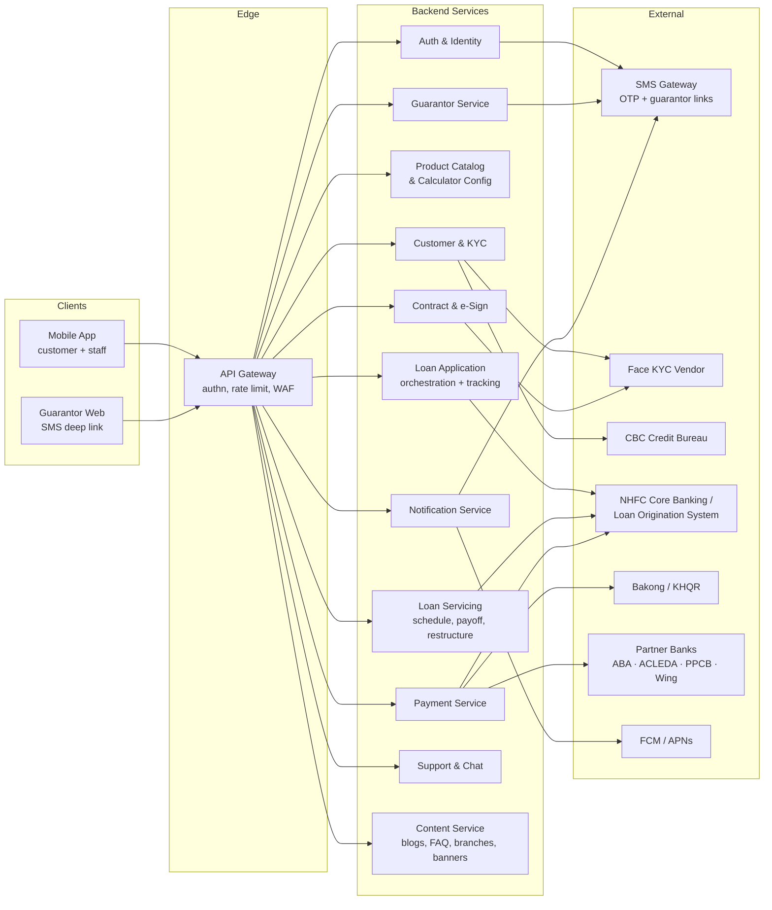
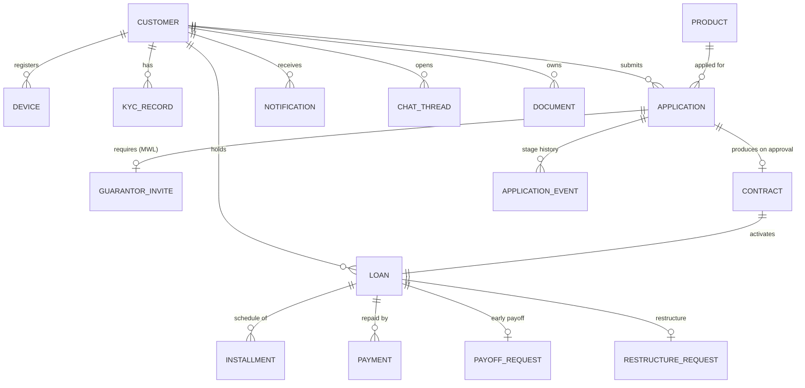
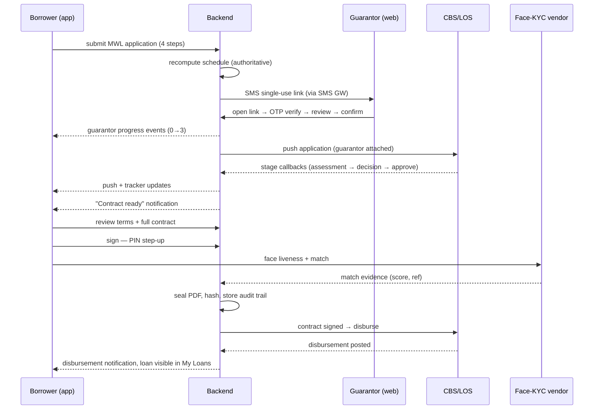
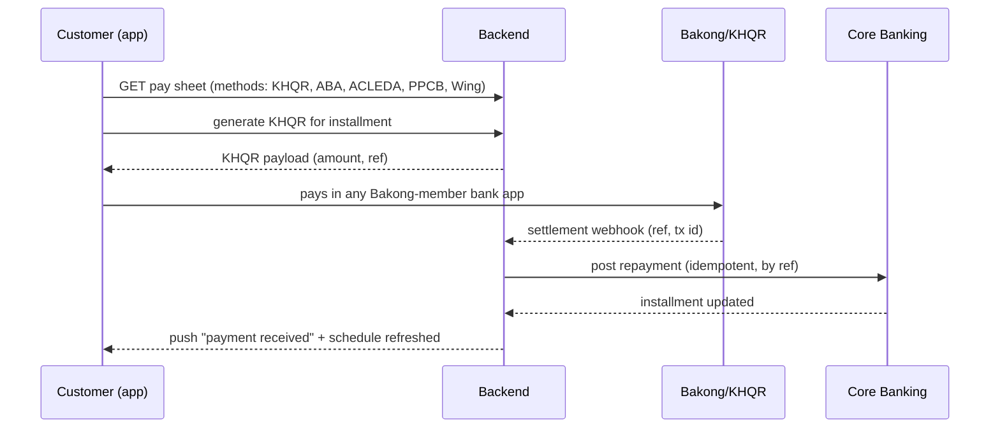
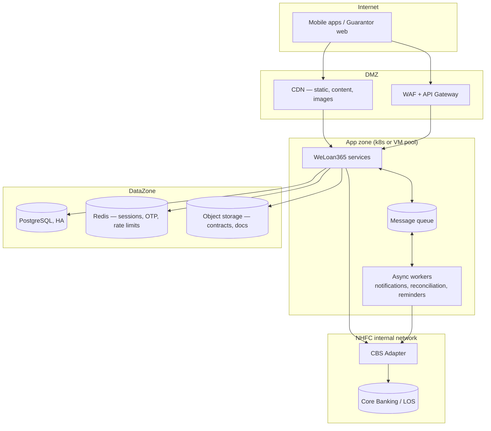

# WeLoan365 (NongHyup Mobile) — System Design

> **Audience:** Development team
> **Functional source of truth:** [Figma — NongHyup Mobile](https://www.figma.com/design/KiL4ZDyCfwzQTiKxEKCgEF/NongHyup-Mobile?node-id=91-45872) and the validated prototype in this repo
> **Scope:** Production system architecture for NongHyup Finance (Cambodia) Plc (NHFC) digital lending — mobile app, guarantor web, backend services, and external integrations.
> **Status:** Proposal for review. Items marked **[ASSUMPTION]** or **[DECISION]** need confirmation with NHFC / infra.

---

## 1. System Overview

WeLoan365 lets NHFC customers discover loan products, apply end-to-end digitally (including guarantor confirmation and e-contract signing), and service their loans (repayment, early payoff, restructuring) from a mobile app. It must integrate with NHFC's loan origination / core banking, Cambodia's credit bureau (CBC), KHQR/partner-bank payments, SMS OTP, and a face-KYC vendor.

### Actors

| Actor | Channel | Capabilities |
|---|---|---|
| Visitor | Mobile app | Browse products, calculator, branch/FAQ, sign up |
| Applicant | Mobile app | Apply (Non-MWL / MWL), track application, sign contract |
| Borrower / Co-Borrower | Mobile app | Loan detail, schedule, repay, early payoff, advance account, restructure |
| Guarantor | **Web (SMS link)** — no app install | Review loan, confirm guarantee identity + consent |
| Staff (NHFC employee) | Mobile app | Staff sign-up with NID + face KYC, Staff Loan (pre-approved terms) |
| Loan officer / back office | NHFC internal systems | Assessment, decision, approval, disbursement (out of app scope) |

### Product / track taxonomy (business logic)

| Track | Products | Application shape |
|---|---|---|
| Non-MWL | Micro Loan (ML), Small Business Loan (SBL), SME Loan, Housing Loan (HL) | Light single-step application → review → submit |
| MWL | Migrant Worker Loan | 4-step application + **mandatory guarantor** + e-contract signing (PIN + face) |
| Staff | Staff Loan | Employee-verified, simplified terms, fast approval |

---

## 2. High-Level Architecture

**Style: modular monolith or microservices?** **[DECISION]** For the expected scale (single-country MFI customer base), a **modular monolith** with the service boundaries above enforced as modules, plus separately deployed **Notification** and **Payment** workers, is the recommended starting point. The boundaries let you split later without redesign. The rest of this doc describes boundaries, not deployment units.

### Communication patterns

- Clients ↔ backend: HTTPS/JSON REST through the gateway. Server push via FCM/APNs; in-app live updates (application status, guarantor progress, chat) via **WebSocket or polling** **[DECISION — recommend SSE/WebSocket for chat + tracker only]**.
- Backend ↔ Core Banking/LOS: synchronous REST/SOAP adapter where NHFC's system allows; otherwise nightly/intraday batch + webhook callbacks. The **CBS adapter** isolates this — no other service talks to CBS directly.
- Internal async: an event bus (e.g. lightweight queue — SQS/RabbitMQ) for `application.submitted`, `application.stage_changed`, `guarantor.confirmed`, `contract.signed`, `payment.settled`, `loan.disbursed` — consumed by Notification, Tracking, and audit.

---

## 3. Component Responsibilities

### 3.1 Auth & Identity
- Phone-number sign-up: OTP issue/verify (SMS gateway), resend throttling, attempt lockout.
- QR sign-in (login on a new device by scanning from an authenticated device).
- Credential = **phone + 6-digit-max PIN (4 digits per design)**; PIN is a credential *and* an in-app gate (§7).
- Issues short-lived **access token (JWT, ~15 min)** + refresh token bound to device ID; device binding/registration, remote device revocation ("manage devices" in Account Security).
- Staff identity: employee lookup (HR feed or CBS staff table **[ASSUMPTION]**) + NID capture + face-KYC match before account activation.

### 3.2 Customer & KYC
- Customer profile (name, NID, photos, documents), profile edit with maker/checker if required by compliance **[DECISION]**.
- KYC orchestration: NID OCR + liveness + face match via vendor; stores vendor reference + score, never raw biometrics.
- CBC consent capture and **credit-report pull**; credit score surface for the app's Credit Score screen.
- Document vault: customer-visible documents (contracts, settlement certificates, schedules) — object storage + signed URLs.

### 3.3 Product Catalog & Calculator Config
- Loan products (ML/SBL/SME/HL/MWL/Staff), rates, term ranges & slider stops, repayment methods allowed per product, promotional banners.
- Serves the **calculator configuration**; the amortization math itself runs client-side for instant UX (formulas in §8) and is **re-computed server-side at application time** — server result is authoritative.
- FX: USD/KHR display rate from a config service (prototype hard-codes 4,000 ៛/$ — must come from NHFC treasury rate **[ASSUMPTION]**).

### 3.4 Loan Application (origination orchestration)
- One **application aggregate** with a track-specific state machine; steps saved server-side so a user can resume mid-application.
- Stage model mirrors the tracker UI: `APPLICATION → ASSESSMENT → DECISION → APPROVE` (+ terminal `REJECTED`, `EXPIRED`, `WITHDRAWN`).
- Pushes the completed application into NHFC's LOS via the CBS adapter; receives stage-change callbacks and republishes them as events (drives tracker + notifications).
- MWL specifics: guarantor requirement blocks progression until `guarantor.confirmed`; grace-period/flat-interest schedule preview.
- Staff specifics: eligibility check against employee record; auto-decision path if NHFC policy allows **[ASSUMPTION]**.

### 3.5 Guarantor Service
- Generates a **single-use, expiring, signed deep link** sent by SMS to the guarantor's phone.
- Guarantor web flow: open link → OTP-verify the guarantor's own number → review loan summary → confirm identity + consent (checkbox + OTP or e-signature per legal requirement **[DECISION]**).
- Tracks 3-step progress (`link_opened → reviewed → confirmed`) — streamed to the borrower's "submitted" screen in near-real-time.
- Link security: tokenized (no loan IDs in URL), TTL (e.g. 72h), IP/device logging, invalidated after confirmation.

### 3.6 Contract & e-Sign
- Renders the final contract (terms locked at approval) as an immutable PDF; versioned templates per product, bilingual (KM/EN).
- Signing ceremony: review terms → full contract document → **PIN re-entry → face scan (liveness + match against KYC photo)** → apply digital signature/seal + timestamp.
- Produces an audit trail (who, when, device, face-match score, document hash) sufficient for legal enforceability under Cambodian e-transaction rules **[DECISION — legal review]**.
- Signed contract stored in the document vault; `contract.signed` event triggers disbursement in CBS.

### 3.7 Loan Servicing
- Read model of active/completed loans, balances and repayment schedules synced from CBS (CBS is the ledger — the app never computes an authoritative balance).
- **Early payoff:** payoff-quote endpoint (principal + accrued interest + fees per policy), confirmation with PIN, submits instruction to CBS, issues settlement certificate on completion.
- **Restructuring:** request capture (reason, proposed conditions) → routed to back office in LOS; status surfaced in-app.
- **Advance account:** balance/history view of the borrower's linked advance account **[ASSUMPTION — CBS product feature]**.
- Repayment schedule detail incl. paid/late flags per installment.

### 3.8 Payment Service
- Repayment methods: **KHQR (scan-to-pay via Bakong)** and partner-bank transfer (ABA, ACLEDA, PPCB, Wing).
- KHQR: generates a per-loan (or per-installment) KHQR payload; listens for settlement callbacks from Bakong; reconciles into CBS.
- Bank transfer: shows virtual-account / reference-code instructions; inbound settlement files or bank webhooks matched by reference **[DECISION per bank]**.
- Idempotent reconciliation job: every settlement maps to exactly one loan/installment posting in CBS; unmatched payments go to an ops exception queue.

### 3.9 Notification Service
- Channels: push (FCM/APNs), SMS, in-app feed (persistent, with read state).
- Event-driven: application stage changes, guarantor progress, contract ready, payment received, due-date reminders (D-3/D-1/overdue scheduler), disbursement, announcements/CSR content.
- Per-user notification preferences (the app's Notification Settings screen).

### 3.10 Support & Chat
- Conversation threads between customer and NHFC support agents; agent side lives in an internal console or an off-the-shelf helpdesk **[DECISION — build vs. integrate e.g. existing NHFC call-center tooling]**.
- Consultation requests (call-back scheduling) routed to branch/call center.

### 3.11 Content Service (CMS)
- Blogs & education, FAQ, About, Terms & Privacy, branch locator (geo data), CSR activity, home banners. Editable by NHFC marketing without app releases; bilingual content model.

---

## 4. Data Model (core entities)

Key notes per entity:

- **CUSTOMER** — id, phone (unique, indexed), name (KM/EN), NID, persona flags (`is_staff`), status. PIN hash (Argon2/bcrypt) lives in Auth, not here.
- **APPLICATION** — track (`NON_MWL | MWL | STAFF`), product, requested amount/term/method, computed schedule snapshot, stage, LOS reference, timestamps per stage (`APPLICATION_EVENT` is the immutable audit trail that feeds the tracker).
- **GUARANTOR_INVITE** — guarantor phone/name, token hash, expiry, step (`SENT | OPENED | REVIEWED | CONFIRMED`), consent evidence (OTP ref, IP, user agent, timestamp).
- **CONTRACT** — template version, locked terms, PDF hash, signature evidence (PIN auth ref, face-match ref/score, signed_at, device).
- **LOAN / INSTALLMENT / PAYMENT** — read-model projections of CBS; `PAYMENT` also stores the acquiring leg (KHQR tx id / bank ref) for reconciliation.
- **DOCUMENT** — type (contract, settlement certificate, schedule export…), object-store key, access-control by customer.

**[DECISION] Source of truth split:** applications, guarantor, contracts, notifications, chat, content → WeLoan365 database (PostgreSQL recommended). Loans, balances, schedules, postings → **CBS**, mirrored read-only into the app DB via the adapter.

---

## 5. API Surface (representative)

All endpoints behind the gateway, versioned under `/api/v1`, JWT bearer auth unless noted.

| Area | Endpoint | Notes |
|---|---|---|
| Auth | `POST /auth/otp/request`, `POST /auth/otp/verify` | Public; rate-limited per phone + IP |
| | `POST /auth/pin/set`, `POST /auth/login`, `POST /auth/refresh` | Login = phone + PIN + device id |
| | `POST /auth/qr/initiate`, `POST /auth/qr/approve` | QR cross-device sign-in |
| Catalog | `GET /products`, `GET /products/{id}`, `GET /calculator/config` | Public (cacheable, CDN) |
| Application | `POST /applications` (draft), `PUT /applications/{id}/steps/{n}`, `POST /applications/{id}/submit` | Resume-able drafts |
| | `GET /applications/{id}/tracker` | Stage + per-stage timestamps |
| Guarantor | `POST /applications/{id}/guarantor-invite` | Sends SMS link |
| | `GET /g/{token}` → web app; `POST /g/{token}/otp`, `POST /g/{token}/confirm` | Public web, token-scoped |
| Contract | `GET /contracts/{id}`, `GET /contracts/{id}/document` | Signed URL to PDF |
| | `POST /contracts/{id}/sign` | Requires fresh PIN step-up + face-scan evidence |
| Servicing | `GET /loans`, `GET /loans/{id}`, `GET /loans/{id}/schedule` | Read models |
| | `POST /loans/{id}/payoff-quote`, `POST /loans/{id}/payoff` | Step-up auth |
| | `POST /loans/{id}/restructure-request` | |
| Payment | `POST /loans/{id}/khqr` (generate), `POST /webhooks/bakong` (callback) | Webhook HMAC-verified |
| Notification | `GET /notifications`, `POST /notifications/read`, `PUT /notification-settings` | |
| Support | `GET/POST /chat/threads`, `POST /chat/threads/{id}/messages`, `POST /consultations` | + WS channel |
| Content | `GET /content/blogs`, `/faq`, `/branches`, `/banners`, `/csr` | Public, CDN-cached, `?lang=km|en` |

Conventions: idempotency keys on all money-adjacent POSTs; cursor pagination; problem+json errors; `Accept-Language` for localized server strings.

---

## 6. Key Sequence Flows

### 6.1 MWL application with guarantor and e-signing

### 6.2 Repayment via KHQR

### 6.3 Onboarding (customer)

`phone → OTP → name → create/confirm PIN → device registered → tokens issued`. Staff additionally: `NID capture → face KYC → employee match → activation`. All OTP and PIN attempts rate-limited and lockout-protected (§7).

---

## 7. Security Design

| Layer | Control |
|---|---|
| Transport | TLS 1.2+ everywhere; certificate pinning in the mobile app **[DECISION]** |
| Authentication | Phone + PIN → JWT access (~15 min) + rotating refresh token bound to device; QR sign-in approves a new device from an existing one |
| PIN | 4-digit per design → **server-side verification only**, Argon2 hash, exponential lockout (the low entropy of 4 digits makes client-side verification unacceptable); optional platform biometrics as a local convenience wrapper for the PIN |
| Session gate | App-level: personal areas (My Loans, Profile, Chat, Notifications, Apply) require PIN once per app session — enforced client-side for UX **and** server-side by scoping tokens |
| Step-up auth | Fresh PIN (and face scan for signing) required for: contract signing, early payoff, profile-sensitive edits — implemented as short-lived step-up tokens, never the session token alone |
| Guarantor links | Signed single-use tokens, 72h TTL, OTP re-verification of the guarantor's own phone, full consent evidence retained |
| Data at rest | DB encryption; documents in object storage with SSE + short-lived signed URLs; biometrics never stored (vendor reference only) |
| PII / compliance | NID and documents access-logged; data-retention per NBC/CBC rules **[DECISION — compliance]**; audit trail immutable (append-only `APPLICATION_EVENT`, signing evidence) |
| App hardening | Root/jailbreak detection, screenshot blocking on PIN/contract screens, no secrets in the bundle **[DECISION — level required]** |
| Abuse | Gateway rate limiting, OTP send caps per phone/IP/day, WAF, webhook HMAC verification |

---

## 8. Domain Logic — Repayment Calculation

Validated in the prototype (`src/screens/loanCalc.ts`) and to be reimplemented server-side as the authoritative engine; the client keeps a copy for instant calculator UX. Monthly rate `r`, principal `P`, term `n`:

| Method | Rule |
|---|---|
| Constant (annuity) | Equal payment `P·r / (1−(1+r)^−n)` |
| Decline | Equal principal `P/n`; interest on declining balance |
| Balloon | Interest-only monthly; full principal in month `n` |
| Mix-Grace | Interest-only for `g` months, then annuity over `n−g` |
| Mix Installment | Annuity sized so ~20% of principal remains as final balloon |
| **MWL grace (flat)** | Flat interest `P·r` every month; interest-only during grace, then principal spread evenly over remaining months |

Product constraints (term stops, allowed methods, rate bands) come from Product Catalog config — never hard-coded. Server and client engines must be verified against a shared golden test-vector file.

---

## 9. Non-Functional Requirements

| Quality | Target (proposed) **[DECISION — confirm with NHFC]** |
|---|---|
| Availability | 99.5% app-facing; graceful degradation when CBS is offline (read models keep serving; writes queue with clear "processing" UX) |
| Performance | p95 API < 400 ms (excluding CBS round-trips); calculator instant (client-side) |
| Scale | Sized for NHFC's customer base; stateless services behind LB, horizontal scale; payment webhooks idempotent for at-least-once delivery |
| Consistency | CBS is the financial source of truth; app read models eventually consistent (seconds) with explicit "as of" freshness where money is shown |
| Observability | Structured logs w/ correlation IDs end-to-end (app → gateway → CBS adapter), metrics + alerting on OTP failure rate, webhook lag, reconciliation exceptions, stage-callback delays |
| Localization | KM (default) + EN throughout, including contracts, notifications, SMS |
| Offline / poor network | App caches catalog + own loans read-only; all writes require connectivity |
| Auditability | Every state transition on applications, contracts, and payments is an immutable event with actor, device, timestamp |

---

## 10. Deployment View

- Environments: `dev → staging (CBS test instance) → production`; infra as code; blue/green or rolling deploys.
- Hosting: cloud vs. on-prem is constrained by NBC data-residency rules and NHFC policy **[DECISION]** — the design above is deployable either way; only the CBS adapter must sit with network line-of-sight to core banking.
- Mobile client: current prototype is a web/PWA; production **[DECISION]** — React Native (reuses React skills/screens) vs. native. Face-KYC SDK availability is the main constraint.

---

## 11. Open Decisions (summary)

1. Deployment style (modular monolith vs. microservices) and hosting (cloud vs. on-prem / data residency).
2. Mobile technology: React Native vs. native iOS/Android (face-KYC SDK support decides).
3. CBS/LOS integration contract: sync API vs. batch + callbacks; which system owns application assessment stages.
4. Guarantor consent legal form (OTP-consent vs. e-signature) and e-contract enforceability sign-off.
5. Payment rails detail per partner bank (virtual accounts vs. reference matching) and Bakong onboarding.
6. Chat: build minimal in-house vs. integrate NHFC's existing support tooling.
7. Real-time channel (WebSocket/SSE vs. polling) for tracker, guarantor progress, chat.
8. Compliance specifics: retention periods, maker/checker on profile edits, app-hardening level.

---

## Appendix A — Functional Screen Inventory (scope reference)

The Figma/prototype defines ~70 screens grouped as: Launch & flow select, Sign-up (phone/OTP/QR/PIN, staff NID + face), Products & detail, Calculator & repayment schedule, My Loans (active / in-review / completed, decision detail, document viewer), Early payoff (form → PIN → success), Advance account, Restructuring (info → conditions → consent → success), MWL apply (4 steps → submitted → tracker → contract → sign review → contract doc → PIN sign → face scan → signed), Guarantor web (SMS → open → review → confirm → confirmed), Non-MWL apply (form → review → success), Staff loan (form → approved), Support (chat, threads, new message, consultation), Profile (view/edit/documents), Notifications & announcements, Credit score (CBC), Settings (security, app settings, notification settings, branches, blogs, feedback, FAQ, contact, about, terms). The prototype in this repo is the navigable reference for every flow above.
